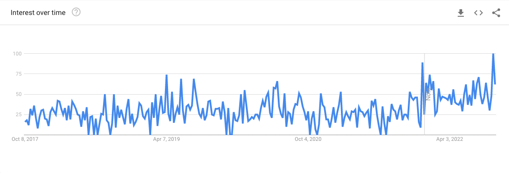

# Rust Book

This is a personally annotated copy of the "The Rust Programming Language"[^1].

<!--
  Fun Emoji I will use in this doc:

  ⚪ Draft
  🟢 Complete
  🟡 In-progress
  🔴 Blocked
-->

[^1]: Available at <https://doc.rust-lang.org/book/>, or `rustup docs --book`.

## Why Rust

For me, I've never really been exposed to low-level systems programming, having
majored in [Informatics](https://www.informatics.uci.edu/) at UC Irvine
precisely to avoid it (and well, math). My first language was Visual Basic 6,
and even though I've grown to love strong, static langauges, I've never really
used C, or anything like it, for anything substantial.

I'd love to Rust to learn more about:

- Lower-level system details, such as memory usage
- Using non-traditional languages
- Mastering the borrow checker

Rust, is well, also pretty cool:



## This repository

Every chapter in the book receives its own folder, i.e.
[`chapter/01-getting-started`](chapter/01-getting-started/README.md):

1. 🟢 [Getting Started](chapter/01-getting-started/README.md)
1. 🟢 [Programming a Guessing Game](chapter/02-guessing-game/README.md)
1. 🟢 [Common Programming Concepts](chapter/03-common-concepts/README.md)
1. 🟢 [Understanding Ownership](chapter/04-understanding-ownership/README.md)
1. 🟢 [Using Structs to Structure Related Data](chapter/05-using-structs/README.md)
1. 🟢 [Enums and Pattern Matching](chapter/06-enums-patterns/README.md)
1. 🟢 [Managing Growing Projects](chapter/07-growing-projects/README.md)
1. 🟢 [Common Collections](chapter/08-common-collections/README.md)
1. 🟢 [Error Handling](chapter/09-error-handling/README.md)
1. 🟢 [Generic Types, Traits, and Lifetimes](chapter/10-generics-traits-lifetimes/README.md)
1. 🟢 [Writing Automated Tests](chapter/11-automated-tests/README.md)
1. 🟢 [An I/O Project: Building a Command Line Program](chapter/12-cli-program/README.md)
1. 🟢 [Functional Langauge Features: Iterators and Closures](chapter/13-functional-features/README.md)
1. 🟢 [More about Cargo and Crates.io](chapter/14-more-cargo/README.md)
1. 🟢 [Smart Pointers](chapter/15-smart-pointers/README.md)
1. 🟢 [Fearless Concurrency](chapter/16-fearless-concurrency/README.md)
1. 🟢 [Object Oriented Programming Features of Rust](chapter/17-object-oriented/README.md)
1. 🟢 [Patterns and Matching](chapter/18-patterns-matching/README.md)
1. 🟢 [Advanced Features](chapter/19-advanced-features/README.md)
1. 🟢 [Final Project: Building a Multithreaded Web Server](chapter/20-web-server/README.md)

Unless otherwise specified, the only tools _required_ to be installed are:

- An IDE ([VSCode][] with [`rust-analyzer`][] preferred, but any will do).
- Rustup and Cargo, often through the [official website][install-rust].
- A [linker][], such as `xcode-select`, `Clang`, or `MSVC`.

[vscode]: https://code.visualstudio.com
[`rust-analyzer`]: https://marketplace.visualstudio.com/items?itemName=rust-lang.rust-analyzer
[install-rust]: https://www.rust-lang.org/tools/install
[linker]: https://doc.rust-lang.org/book/ch01-01-installation.html#installing-rustup-on-linux-or-macos

When possible, copies of other source material, such as PDFs or images, should
be cached in this repository so that the only thing required to interact with
this repository is an installation of Rust, an IDE, a linker, and a clone.

To verify, run `./CHECK.sh`.

### Creating a new chapter

```sh
cargo new chapter/00-chapter-name --name chapter-name --vcs none
```

Then, edit [Cargo.toml](./Cargo.toml) and add the new workspace member:

```toml
members = [
  # ...
  "chapter/00-chapter-name",
]
```

### Adding dependencies

```sh
cargo add package-name -p chapter-name
```
